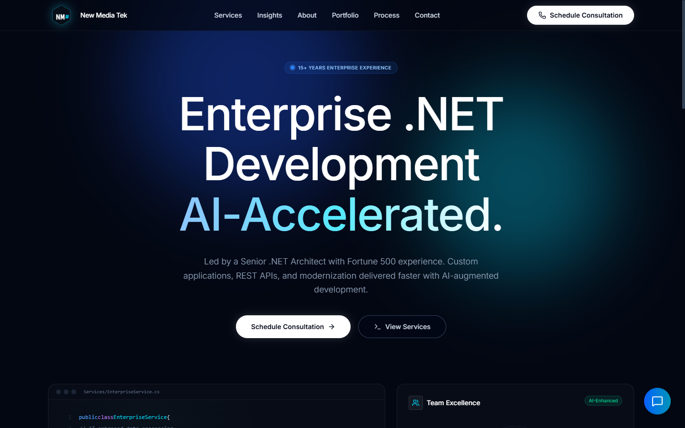
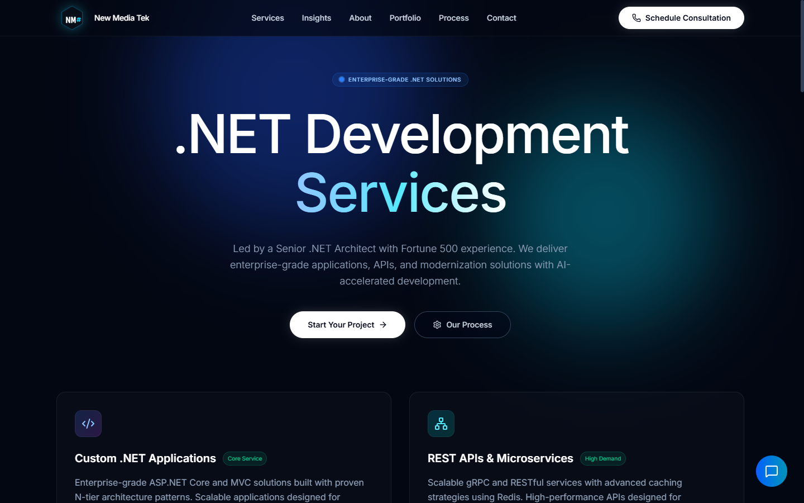
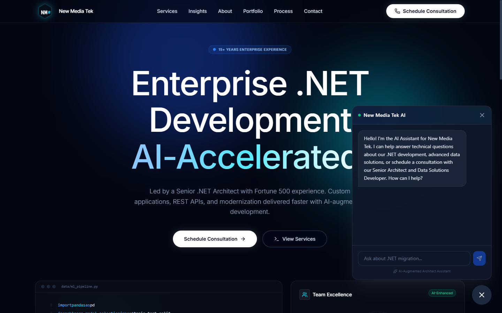

# New Media Tek

> The website for New Media Tek, a senior .NET Architect-led B2B software consultancy.
>
> **Live:** https://newmediatek.net/

New Media Tek is a senior-led .NET consultancy serving Fortune 500 B2B clients; AI-augmented development is one of its service lines. This repository is the complete source for its website — built on Astro 5 + Tailwind 4 with React 19 islands for interactivity, shipping mostly static HTML with near-zero JavaScript. The Scope section below details what is included (public site, Visual CMS, AI chatbot, SEO/AEO, security and email).

## Screenshots

**Homepage**



**Services**



**AI chatbot (lead capture)**



**Visual CMS dashboard** — _screenshot coming soon; the dashboard is being polished._

## Scope

- **Public website.** A dark, glass-morphism B2B site with file-based routing: Home, Services, About, Portfolio, Process, Contact, Capabilities Statement, Contracts, Insights (blog), Privacy, Terms, Admin, and a Success/confirmation page. Built with Astro 5 + Tailwind 4, mounting React 19 islands only where interactivity is needed (CMS dashboard, chat widget, portfolio loader); everything else ships as static HTML with near-zero JavaScript.
- **Custom Visual CMS (`src/components/VISUAL_CMS_Dashboard.jsx`).** Instead of adopting a hosted headless CMS, the site ships a comprehensive visual CMS dashboard on Supabase: page-by-page navigation, field-by-field inline editing, a live preview panel with real-time cursor tracking, resizable edit/preview panels, dynamic portfolio project management, and add/remove-page support. Auth-gated at `/admin` via Supabase Auth, backed by Supabase (`visual_content` / `visual_media` tables) with row-level security (anon read-only, authenticated writes) and the SQL schema in `visual-cms-schema.sql`.
- **Graceful content layer (`src/utils/content.ts`).** Every page pulls copy through `getPageContent()` with hardcoded fallbacks, so the site renders correctly even if Supabase or the CMS is unreachable. No blank pages when the database is down.
- **AI chatbot with lead capture (`src/components/ChatWidget.jsx` + `netlify/functions/chat-api.js`).** An OpenAI/DeepSeek-backed assistant that logs conversations and captures qualified leads (name, email, company, summary) into Supabase, with lead-extraction (`lib/extractLead.js`) and lead-email (`lib/sendLeadEmail.js`) helpers.
- **Security hardening (audit-driven, layered).** A Playwright-driven audit took the site from 78 to 98 and the chatbot from 20 to 100. Defenses span client, server, and database: CSP and security headers (production via `netlify.toml`, dev parity via `src/middleware.ts`), XSS sanitization via DOM text-content encoding, server-side input validation with HTML-entity encoding, in-memory rate limiting (20 req/min/IP), message-history and length caps, environment-based logging that strips PII in production, a Supabase Auth admin gate with row-level security (anon read-only; CMS writes require an authenticated session), and prompt-injection hardening (Layer A: system/guard prompts loaded from Netlify Blobs so they stay out of source control and env vars; Layer B: user-message spotlighting via `<user_input>` delimiters plus output validation that rejects fabricated leads).
- **Secure contact form.** An Astro API route (`src/pages/api/contact.ts`) with server-side validation, sanitization, and email/phone format checks, paired with client-side validation in `src/scripts/contact-form.ts`.
- **Email stack.** Google Workspace hosts the contact/lead mailbox; SendGrid + Nodemailer send transactional and lead-notification email from Netlify Functions; the Netlify email plugin renders the templates (`emails/contact-form/`). DKIM/MX/SPF are configured for deliverability.
- **Insights blog.** Dynamic `[slug].astro` routing backed by `src/data/posts.ts`.
- **Content, SEO, and Answer Engine Optimization.** Ad copy across all pages; per-page meta descriptions, canonical URLs, Open Graph and Twitter Card tags; `@astrojs/sitemap`; a single source of truth for business info in `src/config/site.ts`; and schema.org JSON-LD structured data on every key page — `Organization`, `WebSite`, `ProfessionalService` with an `OfferCatalog` of the service lines, `FAQPage` with `Question`/`acceptedAnswer` pairs (for answer-engine citation), `AboutPage`, and `BreadcrumbList` — so the site is readable by Google AI Overviews, Perplexity, and ChatGPT, not just human visitors.

## Architecture at a glance

| Layer | Choice | Why |
| --- | --- | --- |
| Frontend | Astro 5 (islands) + Tailwind 4 | Content-driven site that ships mostly static HTML; React only where interactivity is needed |
| Interactivity | React 19 islands | CMS dashboard, chat widget, portfolio loader |
| CMS | Custom Visual CMS on Supabase (Postgres) | Visual click-to-edit UX for non-technical editors; no vendor lock-in, full control |
| Backend | Netlify Functions | Chat API, CMS publish handler, contact handler, email helpers |
| Data | Supabase (Postgres + auth) | CMS content, chat logs, lead capture |
| AI | OpenAI / DeepSeek | Chatbot |
| Chat prompts | Netlify Blobs (`chat-prompts` store) | System + guard prompts kept out of source control and env vars; read at runtime via `@netlify/blobs` (`connectLambda` + `getStore`), which also cleared the AWS Lambda 4KB env limit |
| Email | Google Workspace (mailbox) + SendGrid/Nodemailer (transactional) + Netlify email plugin | Contact/lead mailbox and transactional sending from functions; DKIM/MX/SPF configured |
| Hosting | Netlify | `netlify.toml` drives build, headers, functions |
| Tooling | Bun, TypeScript | Fast installs, type safety |

## Key decisions

1. **Astro + islands over a SPA framework.** The site is mostly static content. Astro ships HTML with minimal JS and mounts React only for the CMS dashboard, chat widget, and portfolio loader, giving faster first paint, better SEO, and a smaller payload than a Next/Remix SPA would for this use case.
2. **A custom Visual CMS over a hosted headless CMS.** Sanity or Contentful would have been faster to stand up but impose per-seat pricing, vendor lock-in, and a generic editor UX. A custom visual, click-to-edit CMS on Supabase was built instead, so non-technical editors see exactly where content lands before they type, at the cost of maintaining the dashboard code.
3. **Graceful degradation via CMS fallbacks.** Pages read content through `getPageContent()` with inline fallbacks, so a Supabase outage degrades to the last hardcoded copy instead of a broken page. Uptime over freshness.
4. **No public careers section (a deliberate brand decision).** A public careers page would attract job-seekers and dilute the premium, senior-led, Fortune 500 positioning. A private talent network was chosen instead. A product and brand call, not just a technical one.
5. **Security as a first-class deliverable, not an afterthought.** A Playwright-driven audit, before/after scoring, and layered defenses (client + server + database) rather than a single control. The prompt-injection pass moved the chatbot's system and guard prompts into Netlify Blobs so they stay out of source control and out of env vars (which also cleared the AWS Lambda 4KB env limit that had blocked function deploys).
6. **In-memory rate limiting, with the scale path noted.** `lib/rateLimit.js` uses an in-process store (fine for current traffic on Netlify Functions); the docs explicitly flag Redis as the path to distributed rate limiting at scale. The limitation is acknowledged, not hidden.
7. **Dev/prod security-header parity.** Production headers live in `netlify.toml`; `src/middleware.ts` mirrors them in local dev so the security posture is the same in both environments.
8. **Email deliverability built in, not bolted on.** Google Workspace hosts the contact/lead mailbox; SendGrid + Nodemailer and the Netlify email plugin handle transactional sending from functions; DKIM/MX/SPF are configured so contact and lead emails actually land in inboxes.
9. **CMS authorization via Supabase Auth + RLS, not a static password.** The CMS dashboard signs in through Supabase Auth, and row-level security on the CMS tables allows anon reads (the public site and the build-time content fetch) but only authenticated writes. This keeps the service-role key out of the client, relies on rotating JWTs instead of a static secret, and enforces writes at the database (defense in depth). The publish/rebuild path goes through a small auth'd Netlify Function (`cms-publish.js`) that holds the build-hook URL server-side, so the hook URL is never in the client bundle.

## Tech stack

Astro 5.16 · Tailwind CSS 4.1 · React 19 · TypeScript · Supabase (Postgres + auth) · Netlify Functions · Netlify Blobs · OpenAI / DeepSeek · Google Workspace · SendGrid + Nodemailer · Lucide icons · `@astrojs/sitemap` · Bun

## Project structure

```
src/
├── components/        # Header, Footer, MobileMenu (Astro) + ChatWidget, CMSAuth, CMSDashboard, VISUAL_CMS_Dashboard, PortfolioProjects (React)
├── config/site.ts     # Single source of truth for business/contact info
├── data/posts.ts      # Insights blog posts
├── layouts/           # BaseLayout (head, header, footer, SEO)
├── pages/             # File-based routing + api/contact.ts + insights/[slug].astro
├── scripts/           # contact-form.ts (client validation)
├── utils/             # content.ts (CMS fetch + fallbacks), cms.js
└── middleware.ts      # Dev security headers
netlify/functions/     # chat-api.js, contact-form.js, lib/ (rateLimit, extractLead, sendLeadEmail)
netlify.toml           # Build, security headers, functions, email plugin
visual-cms-schema.sql  # Supabase schema for the Visual CMS
```

## Development

Requires [Bun](https://bun.sh/) and Node 18+. Environment variables are documented in `.env.example` (Supabase URL/keys, AI provider key, SendGrid key, etc.).

```bash
bun install
bun run dev        # http://127.0.0.1:9195
bun run build
bun run preview
bun run check      # astro check (types)
bun run lint       # astro lint
```

## Live

**https://newmediatek.net/** (deployed via Netlify)

## Build credits

Designed, built, and deployed by Kelly Davis. Scope: site design and ad copy, the Astro + Tailwind + React-islands build, the custom Supabase-backed Visual CMS, the AI chatbot with lead capture, SEO and Answer Engine Optimization (JSON-LD structured data), the secure contact form, the Google Workspace + SendGrid/Nodemailer email stack with DKIM/MX/SPF, and the audit-driven security hardening (CSP/headers, XSS sanitization, rate limiting, prompt-injection defense with prompts stored in Netlify Blobs, and Supabase Auth + row-level security for CMS authorization).

## License

Proprietary. (c) 2026 New Media Tek. All rights reserved. No part of this repository may be copied, modified, merged, published, distributed, or sublicensed without prior written permission. See [LICENSE](./LICENSE).
